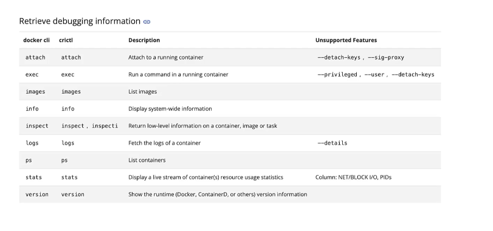

Container tools
1. docker 
2. containerD

Some tools
1. ctr
2. nerdctl
3. crictl

Kubernets only work with docker earlier
but also wanted to support rkt(rocket)

dockershrim

CRI(Containter runtime interface)

OCI(Open Container Intitiative)
1. imagespec
2. runtimespec

containerD
1. cli is ctr
    a. ctr images pull docker.io/library/redis:alpine
    b. ctr run docker.io/library/redis:alpine redis

2. cli nerdctl
• nerdctl provides a Docker-like CLI for containerD
• nerdctl supports docker compose
• nerdctl supports newest features in containerd
    • Encrypted container images
    • Lazy Pulling
    • P2P image distribution
    • Image signing and verifying
    • Namespaces in Kubernetes

Examples.
$ docker
$ docker run --name redis redis:alpine
$ docker run --name webserver -p 80:80 -d nginx

$ nerdctl
$ nerdctl run --name redis redis:alpine
$ nerdctl run --name webserver -p 80:80 -d nginx

• crictl provides a CLI for CRI compatible container runtimes
• Installed seperately 
• Used to inspect and debug container runtimes.
    • Not to create containers ideally.
• Works across different runtimes

$ crictl
$ crictl pull busybox
$ crictl images
$ crictl ps -a
$ crictl exec -i -t 3e025dd50a72d956c4f14881fbb5b1080c9275674e95fb67f965f6478a957d60 ls
$ crictl logs 3e025dd50a72d956c4f1
$ crictl pods

