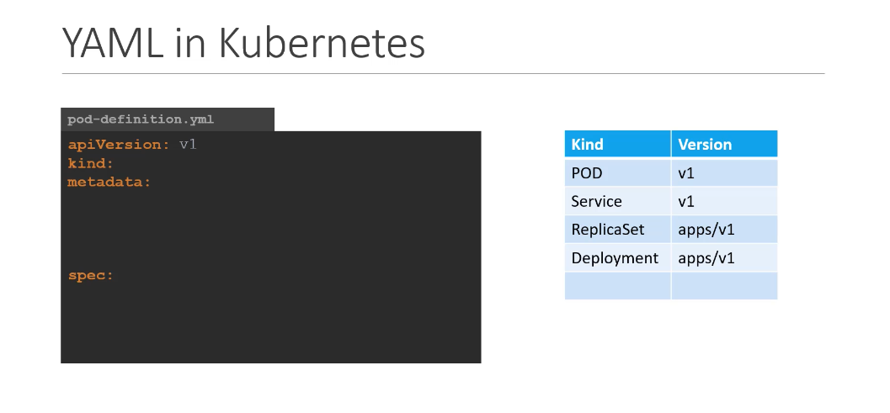

pod-definition.yml
apiVersion: v1
kind: Pod
metadata:
    name: myapp-pod
    labels:
        app: myapp
        type: front-end
spec:
    containers:
        - name: ngnix-container
          image: nginx

kubectl create -f pod-definition.yml

kubectl get pods

k describe pod myapp-podgit 

