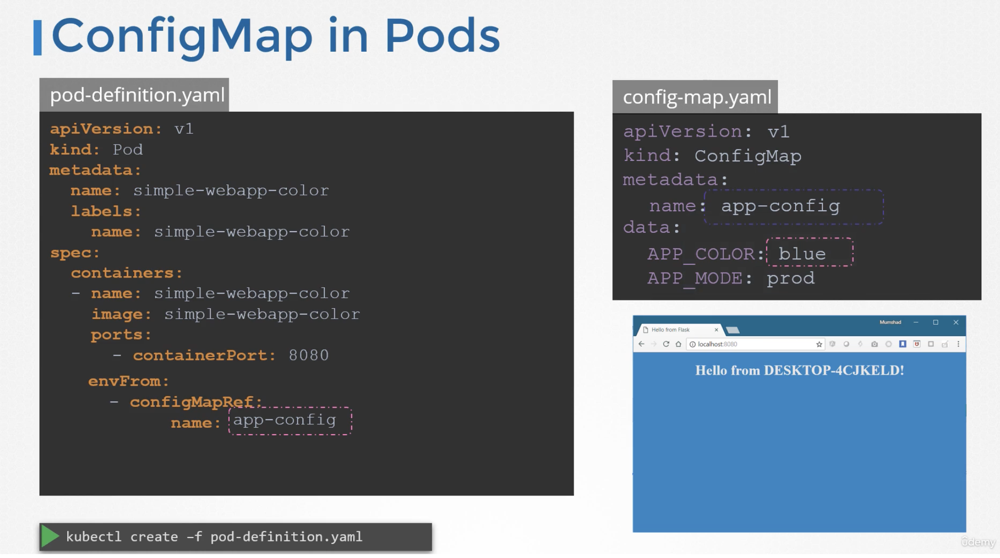
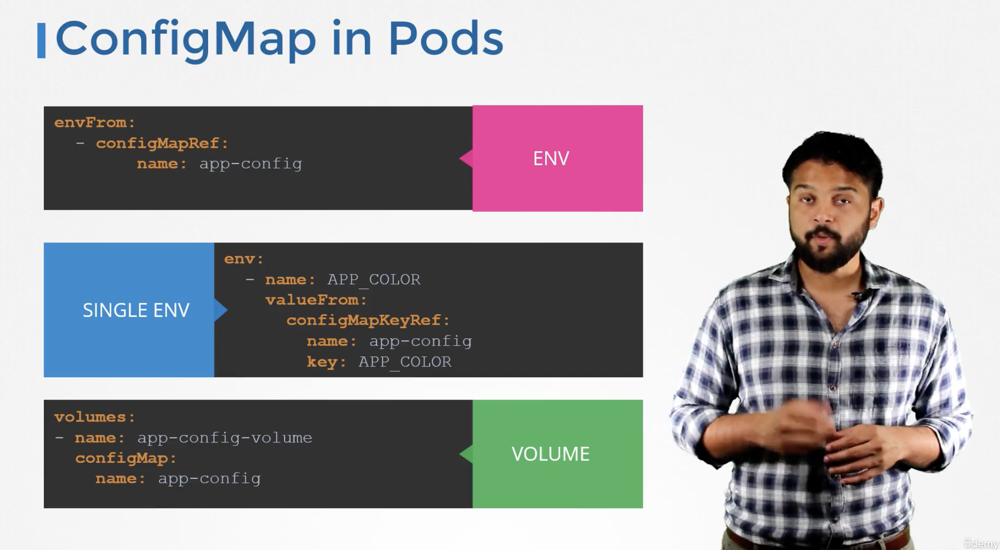

kubectl create configmap <config-name> --from-literal=<key>=‹value>

kubectl create configmap app-config --from-literal=APP_COLOR=blue


kubectl create configmap <config-name> --from-literal=<key>=<value>

kubectl create configmap \
app-config --from-literal=APP_COLOR=blue \
--from-literal=APP_MOD=prod

kubectl create configmap
‹config-name > --from-file=<path-to-file>

kubectl create configmap \
app-config --from-file=app-config.propertres

config-map.yaml
```yaml
apiversion: v1
kind: ConfigMap
metadata:
    name: app-config
data:
    APP_COLOR: blue
    APP_ MODE: prod
```
k create -f config-map.yaml

k get configmaps
k describe configmaps 



