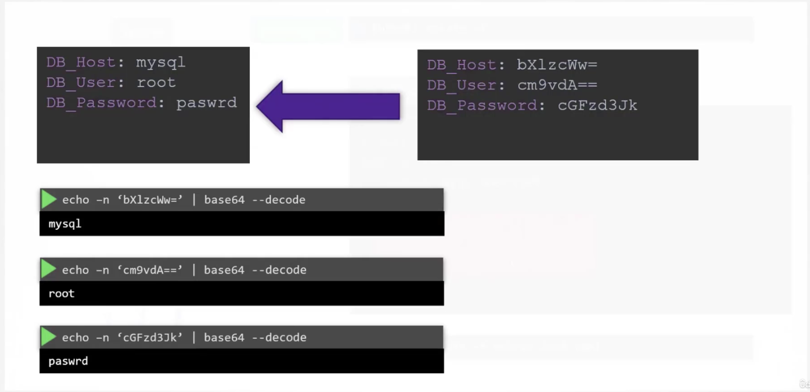

Secrets

```bash
kubectl create secret generic
<secret-name> --from-literal=<key>=‹value>

kubectl create secret generic \
app-secret --from-literal=DB_Host=mysql
--from-literal=DB_User=root
--from-literal=DB_Password=paswrd

kubectl create secret generic
<secret-name> --from-file=<path-to-file>

kubectl create secret generic \
app-secret from-file=app-secret.properties
```





```bash
#ENV
envErom :
    - secretRef:
        name: app-config

#SINGLE ENV
env :
    - name: DB Password
    valueFrom:
        secretKeyRef:
            name: app-secret
            key: DB Password
#VOLUME
volumes:
    - name: app-secret-volume
    secret:
        secretName: app-secret
VOLUME
```

